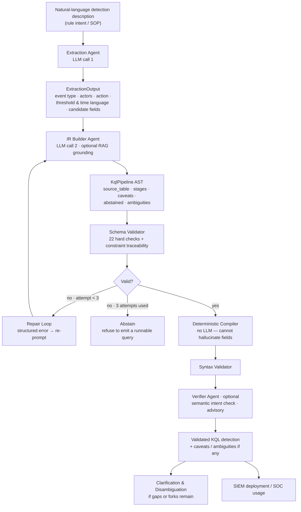
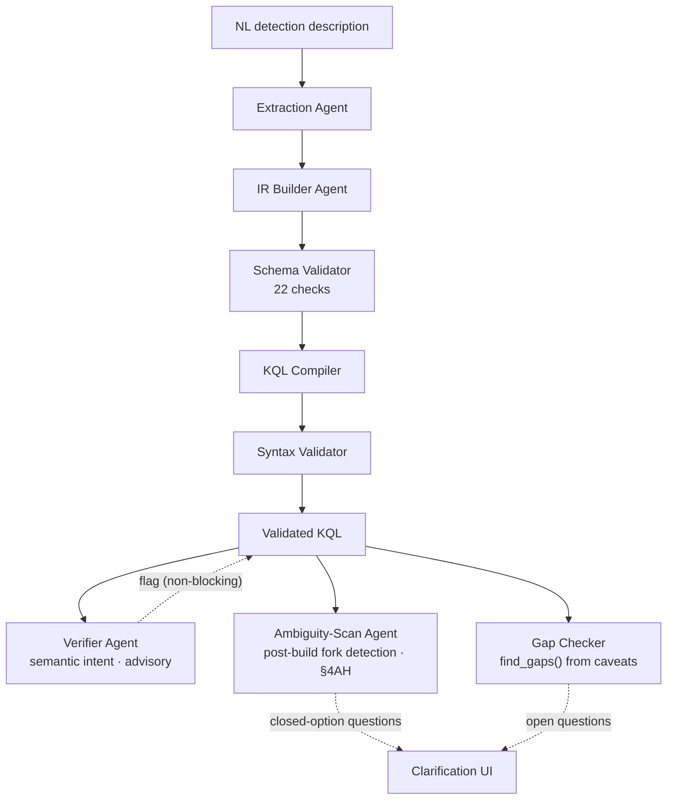
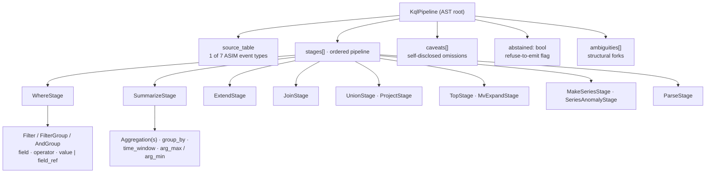
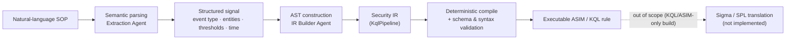
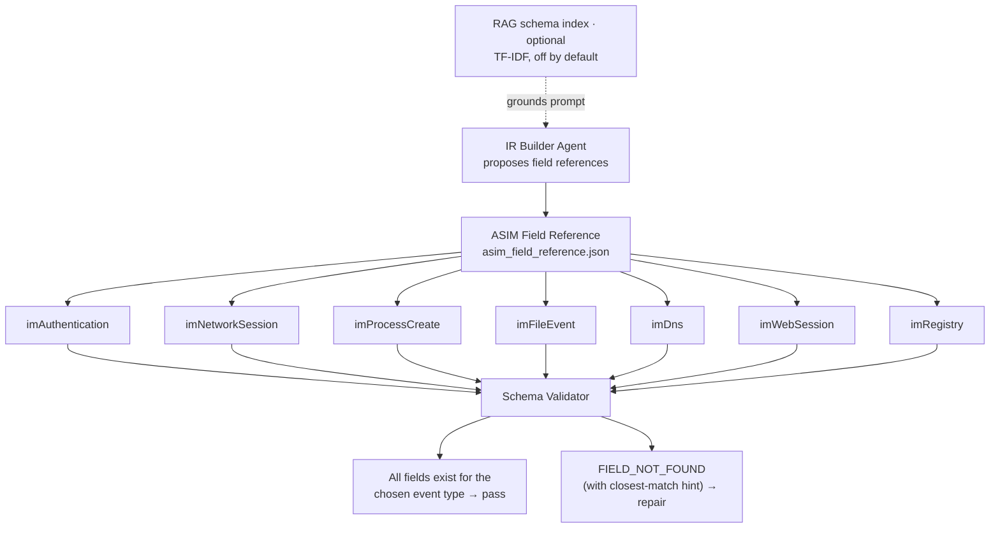
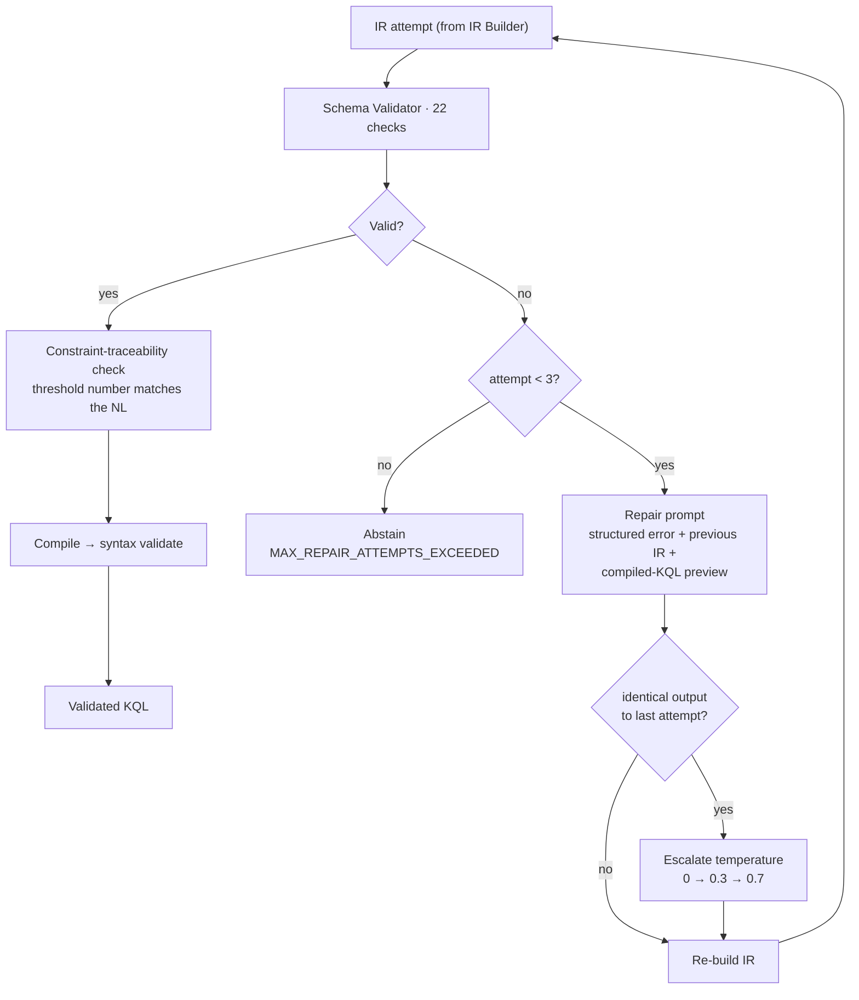
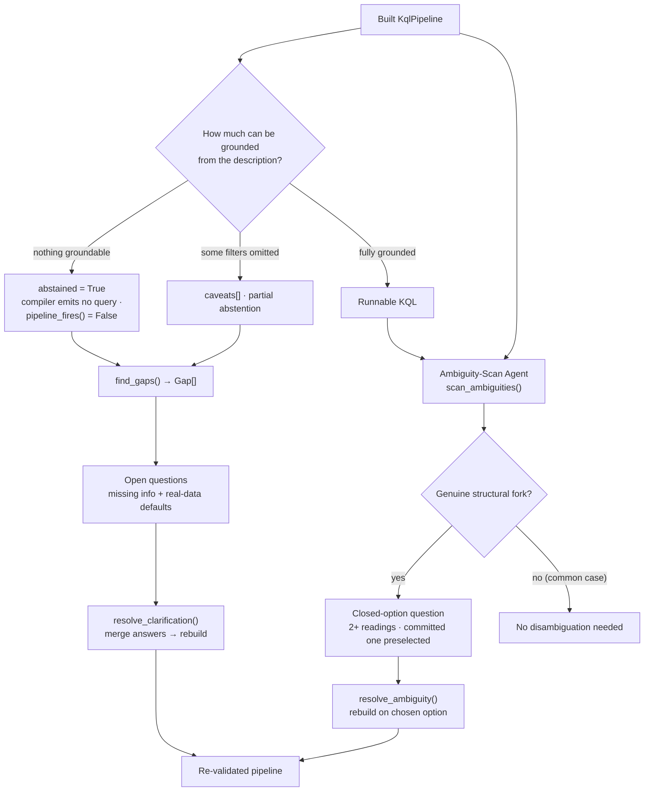
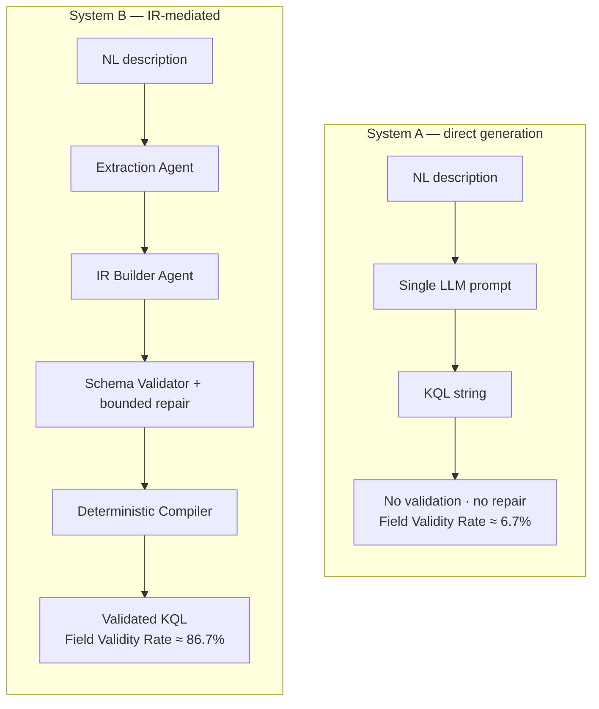
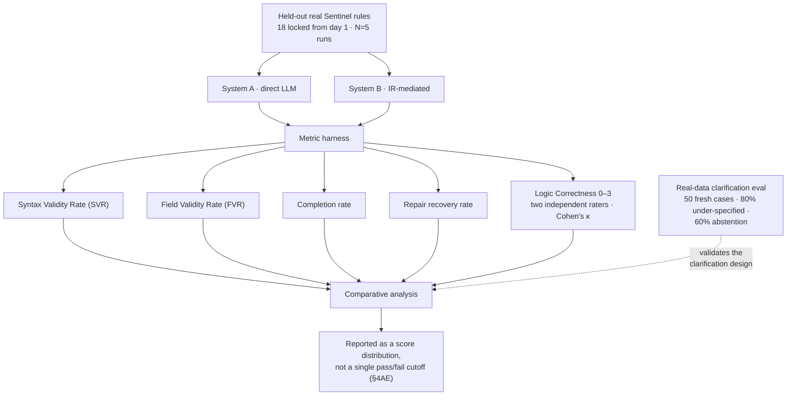
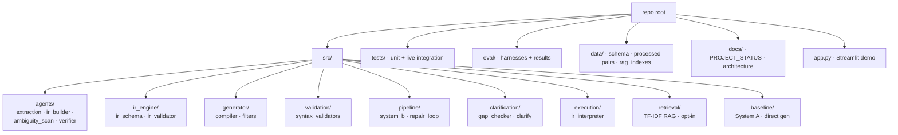

# System Diagrams — IR Framework for SIEM Rule Generation

These diagrams describe **what is actually built**: a KQL/ASIM-only
System B pipeline (two LLM calls, everything else deterministic) with a
bounded repair loop, refuse-to-emit abstention, a clarification loop for
missing information, and a dedicated post-build ambiguity-scan for
genuine structural forks (§4AH).

> **Corrected from the original set.** The previous version of this file
> depicted an aspirational multi-agent, multi-target design (Threat
> Intelligence / Metadata / MITRE agents; Sigma / Splunk-SPL generators;
> OCSF normalization; HDFS / CTI-REALM telemetry execution) that the
> codebase never implemented and that is explicitly out of scope
> (`PROJECT_STATUS.md` §1.1, "KQL/ASIM-only scope"). Every diagram below
> now matches the real modules in `src/`.

## Rendered SVGs

Source `.mmd` files live in [`src/`](src/); rendered SVGs in
[`svg/`](svg/). Re-render all with:

```bash
for f in diags/src/*.mmd; do
  npx -y @mermaid-js/mermaid-cli \
    -i "$f" -o "diags/svg/$(basename "${f%.mmd}").svg" \
    -c diags/src/mermaid-config.json -p diags/src/puppeteer.json -b white
done
```

| # | Diagram | SVG |
|---|---------|-----|
| 1 | High-Level End-to-End System Architecture | [svg](svg/01_high_level_architecture.svg) |
| 2 | Agent & Stage Workflow (2 LLM calls) | [svg](svg/02_agent_workflow.svg) |
| 3 | IR Internal Structure (KqlPipeline AST) | [svg](svg/03_ir_internal_structure.svg) |
| 4 | NL → IR → KQL Transformation Flow | [svg](svg/04_transformation_flow.svg) |
| 5 | ASIM Schema Grounding | [svg](svg/05_asim_schema_grounding.svg) |
| 6 | Validation & Bounded Repair Loop | [svg](svg/06_validation_repair_loop.svg) |
| 7 | Abstention · Clarification · Disambiguation | [svg](svg/07_abstention_clarification_disambiguation.svg) |
| 8 | System A (direct) vs System B (IR-mediated) | [svg](svg/08_system_a_vs_system_b.svg) |
| 9 | Research Evaluation Pipeline | [svg](svg/09_evaluation_pipeline.svg) |
| 10 | Actual Repository Structure | [svg](svg/10_repository_structure.svg) |

**Colour legend** (consistent across all diagrams): blue = LLM /
generative step · green = deterministic code (no LLM) · amber = decision
· purple = data / output · red = abstain / refuse-to-emit.

---

## 1. High-Level End-to-End System Architecture

The real System B path, from a natural-language description to a
validated KQL detection. Only two steps are LLM calls (Extraction, IR
Builder); the validator, compiler, and syntax check are deterministic.



## 2. Agent & Stage Workflow — 2 LLM calls, everything else deterministic

There are exactly two generative agents on the build path (Extraction,
IR Builder), plus a post-build Ambiguity-Scan agent (§4AH) and an
optional advisory Verifier. The validator, compiler, syntax check, and
gap checker are ordinary code.



## 3. Intermediate Representation — KqlPipeline AST

The real schema (`src/ir_engine/ir_schema.py`): a single source table
(one of 7 ASIM event types), an ordered list of 11 possible stage types,
plus the self-disclosure fields `caveats`, `abstained`, and
`ambiguities`.



## 4. NL → IR → KQL Transformation Flow

Single target: KQL over ASIM. Sigma/SPL translation is shown dashed to
mark it explicitly as *not implemented* (the IR is target-agnostic in
principle, but only the KQL compiler exists).



## 5. ASIM Schema Grounding

Field names proposed by the IR Builder are grounded against the ASIM
field reference for the chosen event type; any field not in that event's
schema raises `FIELD_NOT_FOUND` (with a closest-match hint) and routes to
repair. An optional TF-IDF RAG index can additionally ground the prompt
(off by default, §4AE).



## 6. Validation & Bounded Repair Loop

The actual loop: max 3 attempts, structured error messages fed back into
the prompt, temperature escalation when the model repeats an identical
failing output, and abstention (not an infinite retry) on exhaustion.



## 7. Abstention · Clarification · Disambiguation

The honest-uncertainty story. Missing information becomes open questions
(`find_gaps` → `resolve_clarification`); a genuine structural fork
becomes a closed-option question (`scan_ambiguities` → `resolve_ambiguity`);
a totally ungroundable description sets `abstained=True`, and the
compiler refuses to emit any runnable query.



## 8. Direct LLM (System A) vs IR-Mediated Pipeline (System B)

The core comparison, with the measured headline numbers: direct
generation reaches ~6.7% Field Validity Rate on fresh inputs; the
IR-mediated pipeline reaches ~86.7%.



## 9. Research Evaluation Pipeline

Held-out real Sentinel rules (18 locked from day 1, run N=5 for
variance), System A vs System B, scored on the metrics actually used —
including Logic Correctness on a 0–3 scale by two independent raters
(Cohen's κ), reported as a distribution rather than a single pass/fail
cutoff (§4AE). The 50-case real-data clarification eval validates the
clarification design separately.



## 10. Actual Repository Structure

The real module layout under `src/` (plus `tests/`, `eval/`, `data/`,
`docs/`, and the Streamlit `app.py`).


